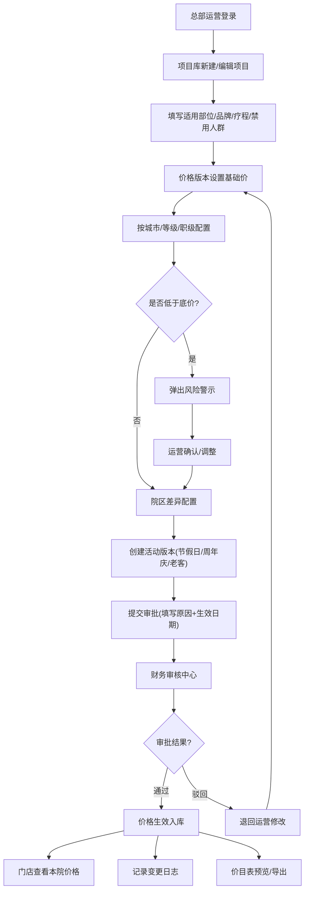

## 1. 产品概述

连锁医美价格体系维护 Web 工作台，面向总部运营、院区店长和财务审核人员，统一管理玻尿酸、光电、皮肤管理、抗衰套餐等医美项目的全生命周期价格。解决总部发错价、门店用旧价的痛点，确保全国连锁体系价格执行的一致性与合规性。

## 2. 核心功能

### 2.1 用户角色

| 角色 | 登录方式 | 核心权限 |
|------|----------|----------|
| 总部运营 | 账号密码登录 | 新建/编辑项目、创建价格版本、设置院区差异、发起审批、查看全部数据、导出价目表 |
| 财务审核 | 账号密码登录 | 审批价格变更、逐项批注、通过/驳回、查看变更日志 |
| 院区店长 | 账号密码登录 | 仅查看本院可执行价格、查看价目表预览、导出本院价目表 |

### 2.2 功能模块

1. **项目库**：项目 CRUD、适用部位、耗材品牌、疗程次数、禁用人群、快速检索
2. **价格版本**：基础价设置（城市/门店等级/医生职级）、节假日版本、周年庆版本、老客专享版、底价风险提示
3. **院区差异**：按院区差异化定价、批量复制模板、生效日期管理
4. **审批流**：提交变更（原因+生效日期）、财务批注、通过/驳回、审批状态追踪
5. **变更日志**：改价人记录、改价前后值、影响门店范围、操作时间线
6. **价目表预览**：前台咨询价目展示、按院区/角色查看、PDF/Excel 导出

### 2.3 页面详情

| 页面名称 | 模块名称 | 功能描述 |
|----------|----------|----------|
| 工作台首页 | 数据概览 | 待审批数量、今日变更数、在版项目数、风险预警卡片 |
| 工作台首页 | 快捷入口 | 6 大模块快捷卡片导航、最近操作记录 |
| 项目库 | 项目列表 | 搜索栏（项目名/品牌/分类）、筛选栏、项目表格、分页 |
| 项目库 | 新增/编辑项目 | 项目基础信息、适用部位多选、耗材品牌、疗程次数、禁用人群、项目图片 |
| 价格版本 | 版本列表 | 版本类型标签（基础/节假日/周年庆/老客专享）、版本状态、版本时间范围 |
| 价格版本 | 版本详情 | 城市维度定价、门店等级定价、医生职级定价矩阵、底价红线、风险提示条 |
| 院区差异 | 院区矩阵 | 院区列表树、差异化价格编辑、批量应用模板、生效日期 |
| 审批中心 | 待审批列表 | 待办卡片、变更摘要、改价前后对比、影响门店数量 |
| 审批中心 | 审批详情 | 逐项批注、通过/驳回按钮、填写审批意见 |
| 变更日志 | 时间轴 | 筛选（项目/操作人/时间/院区）、变更详情抽屉、前后值高亮对比 |
| 价目表预览 | 价目展示 | 院区选择器、项目分类 Tab、价格卡片、咨询电话水印 |
| 价目表预览 | 导出功能 | PDF 导出、Excel 导出、打印友好视图 |

## 3. 核心流程

总部运营在项目库新建项目并填写适用部位、耗材品牌等信息，然后在价格版本模块设置基础价及各类活动价，通过院区差异模块配置各门店特殊定价。低于底价时系统自动弹出风险警示。运营确认后提交审批，填写变更原因与生效日期。财务审核人员在审批中心逐项查看变更内容，可批注通过或驳回。审批通过后价格自动生效，院区店长仅能查看本院最终可执行价格，所有操作均被记录至变更日志，支持随时回溯。

## 4. 用户界面设计

### 4.1 设计风格

- **主色调**：深墨蓝 `#1B2A4A`（专业可信），搭配医疗金 `#C9A96E`（医美高端感）
- **辅助色**：警示红 `#E5484D`（底价风险）、成功绿 `#12B76A`（审批通过）、中性灰系列
- **按钮风格**：圆角 8px，主按钮实心深墨蓝配金色描边，次按钮描边风格，危险按钮红色渐变
- **字体**：标题使用「思源宋体 CN」（典雅高端），正文使用「Noto Sans SC」（清晰易读）
- **布局风格**：左侧深色导航栏 + 顶部面包屑 + 主内容卡片式布局，表格密度适中
- **图标风格**：线性描边图标 + 关键节点金色填充，统一 24px 栅格

### 4.2 页面设计概览

| 页面名称 | 模块名称 | UI 元素 |
|----------|----------|----------|
| 工作台首页 | 数据概览 | 4 张渐变数据卡片（待审/变更/项目/风险），数字大字排版，指标趋势微折线 |
| 工作台首页 | 快捷入口 | 6 宫格模块卡片，hover 金色描边上浮，图标+文字双层结构 |
| 项目库 | 项目列表 | 顶部搜索栏带品牌筛选 Tag，表格首列项目缩略图，状态用 Badge 展示 |
| 价格版本 | 版本详情 | 三维定价矩阵表（城市×等级×职级），底价行红色描边高亮，悬浮风险气泡 |
| 审批中心 | 审批详情 | 左右分栏：左侧变更对比（旧值删除线，新值高亮），右侧财务批注侧滑面板 |
| 变更日志 | 时间轴 | 左侧竖向时间线带金色圆点，右侧变更卡片，点击展开对比抽屉 |
| 价目表预览 | 价目展示 | 分类 Tab 切换，价格卡片玻璃拟态，院区选择器顶部悬浮，品牌 Logo 展示 |

### 4.3 响应式

桌面端优先设计（最小 1280px），左侧导航固定 240px。1440px 以上自适应增宽表格列，移动端（< 1024px）折叠左侧导航为汉堡菜单，表格转卡片列表展示。

### 4.4 动效设计

- 页面加载：主内容区淡入 + 卡片依次上浮（stagger 80ms）
- 表格行 hover：浅金色背景过渡 + 左侧 3px 金色竖线滑入
- 审批通过/驳回：按钮点击后波纹扩散 + 顶部 Toast 通知滑入
- 风险警示：红色边框脉冲动画（2 秒循环）+ 警示图标轻微晃动
- 抽屉展开：遮罩淡入 + 内容从右侧滑入（300ms cubic-bezier）
