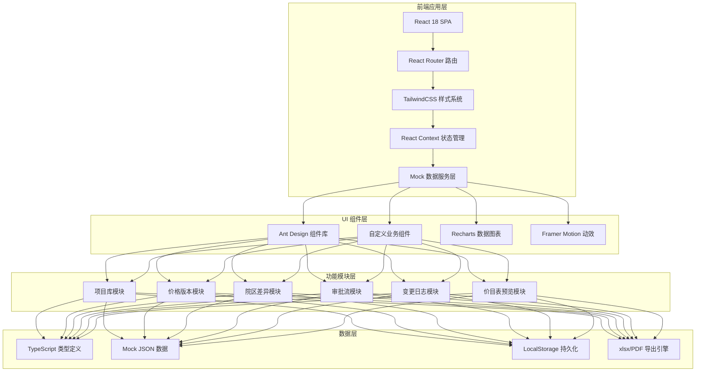
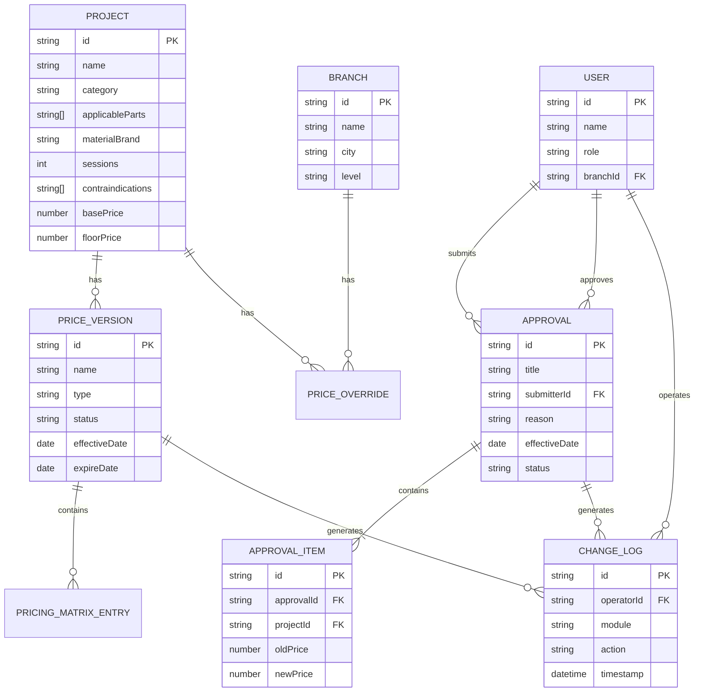

## 1. 架构设计



## 2. 技术选型说明

- **前端框架**：React@18 + TypeScript@5，提供类型安全与现代开发体验
- **构建工具**：Vite@5，快速启动与热更新
- **样式方案**：TailwindCSS@3.4，配合设计 Token 实现主题一致性
- **UI 组件库**：Ant Design@5，深度定制主题色（深墨蓝+医疗金）
- **路由管理**：React Router Dom@6，嵌套路由支持模块内子页
- **状态管理**：React Context + useReducer，避免过度工程化
- **图表**：Recharts@2，用于趋势数据与审批统计
- **动效**：Framer Motion@11，实现审批对比、抽屉、脉冲警示
- **导出**：xlsx@0.18 / html2canvas + jsPDF，价目表导出
- **图标**：@ant-design/icons + 自定义 SVG 图标

## 3. 路由定义

| 路由路径 | 页面/模块 | 访问角色 |
|----------|----------|----------|
| `/login` | 登录页（角色切换演示） | 全部 |
| `/dashboard` | 工作台首页（数据概览+快捷入口） | 全部 |
| `/projects` | 项目库列表 | 总部运营/财务 |
| `/projects/new` | 新增项目 | 总部运营 |
| `/projects/:id/edit` | 编辑项目 | 总部运营 |
| `/price-versions` | 价格版本列表 | 总部运营/财务 |
| `/price-versions/:id` | 版本详情（定价矩阵） | 总部运营/财务 |
| `/branch-diff` | 院区差异配置 | 总部运营 |
| `/approvals` | 审批中心列表 | 财务/总部运营 |
| `/approvals/:id` | 审批详情 | 财务/总部运营 |
| `/change-logs` | 变更日志时间轴 | 总部运营/财务 |
| `/price-preview` | 价目表预览 | 全部（门店仅本院） |

## 4. 核心数据类型定义

```typescript
// 项目分类
type ProjectCategory = 'hyaluronic' | 'photoelectric' | 'skin' | 'anti-aging';

// 项目
interface Project {
  id: string;
  name: string;
  category: ProjectCategory;
  applicableParts: string[];          // 适用部位
  materialBrand: string;               // 耗材品牌
  sessions: number;                    // 疗程次数
  contraindications: string[];         // 禁用人群
  basePrice: number;                   // 基础指导价
  floorPrice: number;                  // 底价红线
  imageUrl: string;
  status: 'active' | 'inactive';
  createdAt: string;
}

// 价格版本类型
type VersionType = 'base' | 'holiday' | 'anniversary' | 'loyalty';
type VersionStatus = 'draft' | 'pending' | 'approved' | 'effective' | 'expired';

// 价格版本
interface PriceVersion {
  id: string;
  name: string;
  type: VersionType;
  status: VersionStatus;
  effectiveDate: string;
  expireDate: string;
  description: string;
  pricingMatrix: PricingMatrix;
  createdBy: string;
}

// 定价矩阵（城市 × 门店等级 × 医生职级）
interface PricingMatrix {
  [projectId: string]: {
    [cityTier: string]: {
      [storeLevel: string]: {
        [doctorLevel: string]: number;
      };
    };
  };
}

// 院区
interface Branch {
  id: string;
  name: string;
  city: string;
  cityTier: 'tier1' | 'tier2' | 'tier3';
  level: 'flagship' | 'standard' | 'community';
  priceOverrides: PriceOverride[];
}

interface PriceOverride {
  projectId: string;
  versionId: string;
  customPrice: number;
  effectiveDate: string;
}

// 审批单
interface Approval {
  id: string;
  title: string;
  submitter: string;
  submittedAt: string;
  reason: string;
  effectiveDate: string;
  status: 'pending' | 'approved' | 'rejected';
  items: ApprovalItem[];
  approver?: string;
  approvedAt?: string;
  comments?: ApprovalComment[];
}

interface ApprovalItem {
  projectId: string;
  projectName: string;
  oldPrice: number;
  newPrice: number;
  floorPrice: number;
  affectedBranches: string[];
  note?: string;
  annotation?: string;   // 财务批注
}

interface ApprovalComment {
  approver: string;
  content: string;
  timestamp: string;
}

// 变更日志
interface ChangeLog {
  id: string;
  operator: string;
  action: 'create' | 'update' | 'approve' | 'reject' | 'publish';
  module: 'project' | 'price' | 'branch' | 'version';
  targetId: string;
  targetName: string;
  oldValue: any;
  newValue: any;
  affectedBranches: string[];
  timestamp: string;
}

// 用户角色
type UserRole = 'hq-admin' | 'finance' | 'store-manager';

interface User {
  id: string;
  name: string;
  role: UserRole;
  branchId?: string;   // 门店店长绑定
  avatar: string;
}
```

## 5. 数据模型关系图


